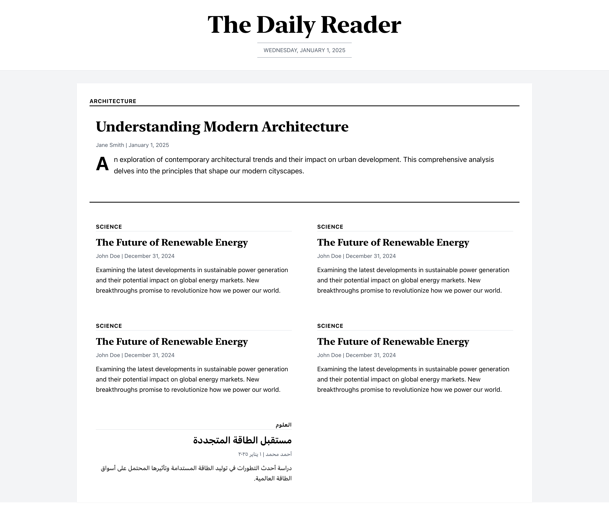
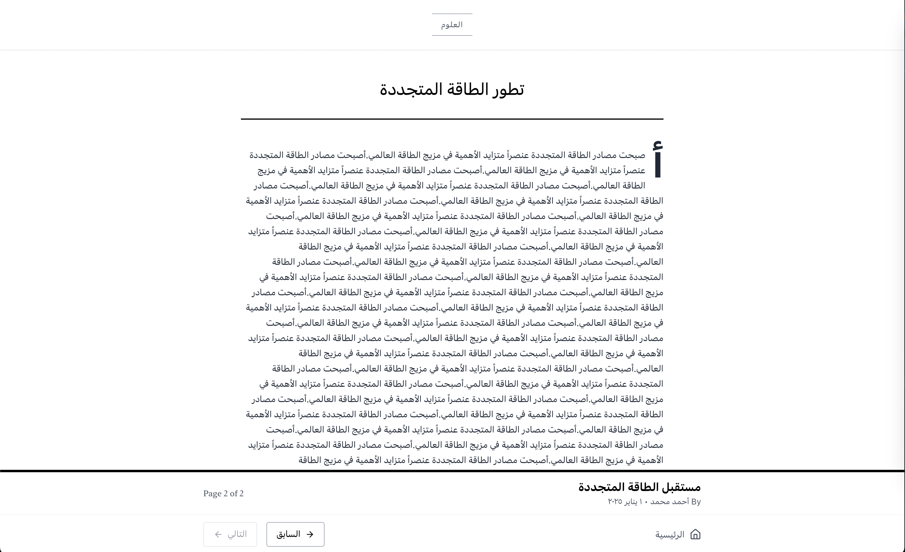
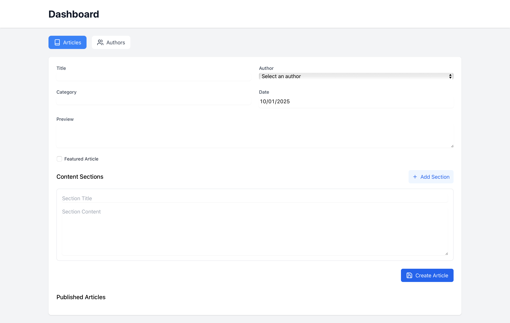

# Breif Overview

This project is a web application that allows users to read books in different languages. The application supports both LTR and RTL languages. The application has two main roles, the reader and the admin. The reader can read books and change the language of the book. The admin can add, edit, and delete books.

## Screenshots Table

|              Screenshot               |   Description   |              Screenshot               |   Description   |
| :-----------------------------------: | :-------------: | :-----------------------------------: | :-------------: |
|       |    Home Page    |  | LTR Reader Page |
|  | RTL Reader Page |      |    Dashboard    |
